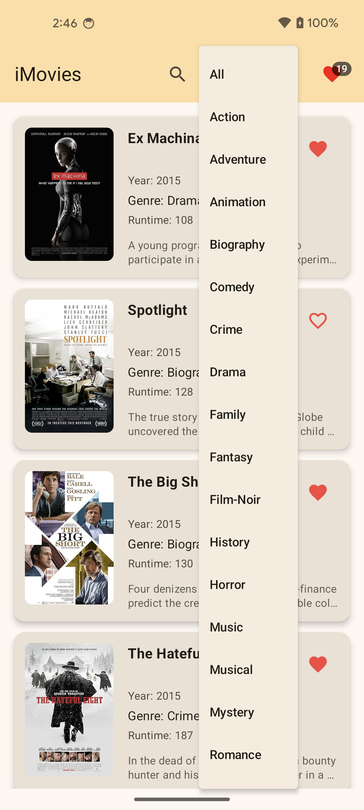

## iMovies – Modern Movie App

A modern IMDB-like Android application built with **Jetpack Compose**, **Clean Architecture**, and **offline-first** design.  
Fetches movie data once, stores it locally with **Room**, and runs entirely offline after the initial load.  
Includes **wishlist**, **search**, **filter**, and **pagination** features.

---

## Screenshots
| Splash Screen | Movie List | Movie Details |  Wishlist |  Search  |  Filter  |
|---------------|------------|---------------|-----------|----------|----------|
| ** | ** | ** | ** | ** | ** |

---

## Features

### Core Features
- **Splash Screen**
    - Checks internet connectivity on first launch.
    - Fetches movie data from remote notwork and stores locally.
    - Offline-first behavior (no re-fetch unless app data is cleared).

- **Movie List**
    - Displays movies in **reverse chronological order**.
    - **Pagination**: 10 items per page from local DB.
    - **Filter by Genre** via dropdown.
    - **Search** by movie title.
    - **Wishlist badge** in AppBar showing live count.

- **Movie Details**
    - Displays complete information about a selected movie.

- **Wishlist Screen**
    - Lists all wishlisted movies.
    - Remove from wishlist.

- **Offline Persistence**
    - **Room Database** to store movies and wishlist state.

- **Architecture**
    - **MVVM + Repository Pattern**.
    - Dependency Injection with **Hilt**.
    - State management using **StateFlow** and **Compose State**.

---

### Bonus Features
- **Dark/Light Theme** support with dynamic color. App automatically detects device default color mode.
- **Jetpack Compose animations**.

---

## Tech Stack

| Layer | Technology |
|-------|------------|
| **Language** | Kotlin |
| **UI** | Jetpack Compose, Material 3 |
| **Architecture** | Clean Architecture (MVVM + Repository) |
| **Persistence** | Room Database |
| **DI** | Hilt |
| **Async** | Kotlin Coroutines, StateFlow |
| **Networking** | Retrofit, OkHttp |

---

## Project Structure
```
iMovies/
 ├── data/               # Data Layer (Repositories, DAOs, Retrofit Services) 
 ├── domain/             # Business Logic (UseCases, Models)
 └── presentation/       # Presentation Layer (UI, ViewModels, Navigation) 
```

---

## API
Movies data is fetched from:
```
https://raw.githubusercontent.com/erik-sytnyk/movies-list/master/db.json
```

---

## Installation & Setup
1. **Clone the repo**
   ```bash
   git clone git@github.com:mknishad/iMovies-android.git
   cd iMovies-android
   ```

2. **Open in Android Studio** (Narwhal+ recommended)

3. **Build & Run**
    - Minimum SDK: 24
    - Target SDK: 36

4. **First Launch**
    - Make sure device/emulator is connected to the internet.
    - Movies will be fetched and cached locally.

---

## Architecture Overview
The project follows **Clean Architecture** principles:

- **Presentation Layer**:  
  Composables, State management with `StateFlow`, observes ViewModels.

- **Domain Layer**:  
  Business rules, use cases, pure Kotlin (no Android dependencies).

- **Data Layer**:  
  Repositories, local data source (Room), remote data source (Retrofit).

Data Flow:
```
UI (Compose) → ViewModel → UseCase → Repository → Local/Remote Source
```

---

## Deliverables
- Full source code (this repo)
- README.md (you are reading it)
- APK file: [Download](https://drive.google.com/file/d/163tjJvkoC4hhtihuHark5K85J5Du25zh/view?usp=share_link)
- Git commit history with meaningful messages

---

## Author
**Monir Hossain**  
mknishad111@gmail.com | [LinkedIn](https://www.linkedin.com/in/mknishad) | [Portfolio](https://mknishad.github.io)

---

## License
This project is for **interview assessment purposes only**.  
All code is original work.
